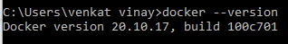
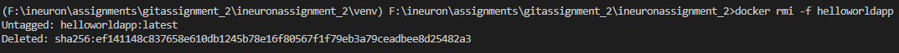
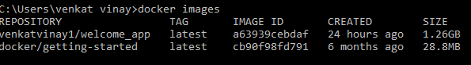
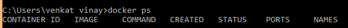
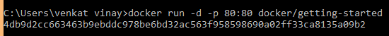
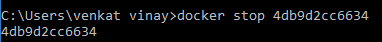

# ineuronassignment_2

## Task1: Docker Commands with screenshots.

01. Docker version 

02. Docker build

03. docker delete image.

04. docker images.

05. docker ps: Lists the running containers.

06. docker run. 

07. docker stop: stops the running containers.

